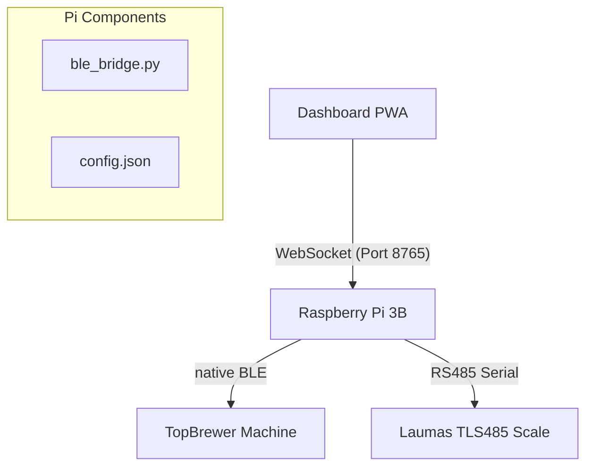

# SiloOS - Native BLE Coffee Gateway

SiloOS is a production-ready hardware bridge that connects a Scanomat TopBrewer coffee machine to a high-precision Laumas TLS485 scale and a modern React PWA. 

By moving the Bluetooth logic from the browser to a Raspberry Pi "Brain", we achieve significantly improved reliability, better range, and multi-device support.

## System Architecture



## Quick Setup (Automatic)

If you are setting up a fresh Raspberry Pi (OS Lite 64-bit recommended):

1.  **Clone the Repo**: `git clone <repo_url> SiloOS`
2.  **Run Installer**: `cd SiloOS && sudo ./setup.sh`
3.  **Configure**: Edit `config.json` with your machine's MAC address.
4.  **Start Dashboard**: `cd dashboard && npm run dev -- --host`

## Manual Setup Components

### 1. Bluetooth Gateway (`ble_bridge.py`)
The primary Python script that handles:
-   **Authenticated WebSocket Relay**: Secures the link via `?auth=TOKEN`.
-   **BLE Management**: Real-time notification relay for SFWU packets and brew status.
-   **Hardware Handshake**: Automatic self-healing via `bluetoothctl` resets if a connection stalls.
-   **Scale Integration**: Parses Modbus-like serial packets from the RS485 bridge.

### 2. High-Precision Scale
-   **Baud Rate**: 115200 (Parity: Even, Stop bits: 1).
-   **Wiring**: See [HARDWARE.md](HARDWARE.md) for terminal pinouts (Terminals 28/29).
-   **Precision**: Broadcasts weight at sub-gram granularity for gravimetric dosing.

### 3. Dashboard PWA
-   **RemoteBLEAdapter**: A drop-in replacement for Web Bluetooth that redirects all GATT operations to the Pi.
-   **Dashboard UI**: Specialized SiloOS dashboard focused on bean weight monitoring and gravimetric control.

## Security
Connections to the bridge require a security token defined in `config.json`. The PWA is pre-configured to use this token automatically within the internal network.

## Maintenance
To sync changes from a development laptop to the Pi, use the `/sync-project` workflow:
```bash
# From laptop
scp -i ./siloos_key ./ble_bridge.py siloos@10.0.124.90:/home/siloos/ble_bridge.py
ssh -i ./siloos_key siloos@10.0.124.90 "sudo systemctl restart scale_bridge"
```
